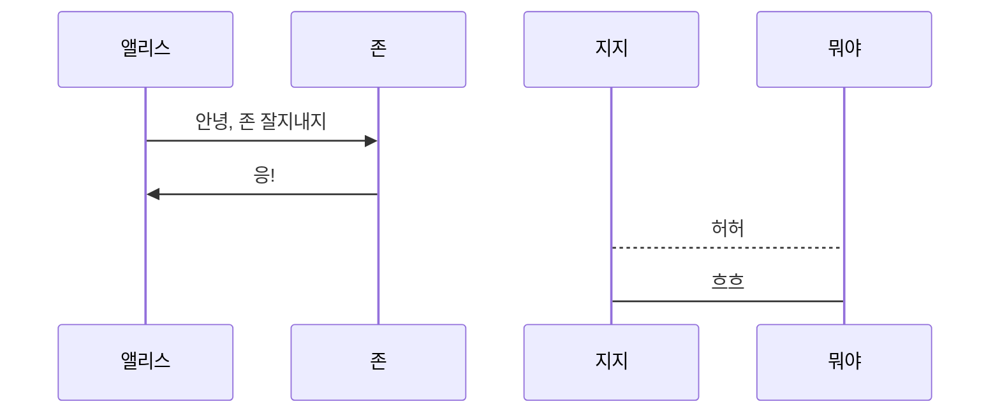

# Web

## 1. Intro

### 1.1. Static Web

접속할 때마다 변화할 필요없는 사이트

예) 학교 홈페이지, 댓글 기능이 없는 블로그

> 바크콜 하나 주세요 .
>
> 아메리카노 나왔습니다.
>
> 카페라떼 주세요.
>
> 아메리카노 나왔습니다.


### 1.2. Dynamic Web

접속할 때마다 변해야 할 필요가 있는 사이트


URI ?

URL 보다 상위의 개념, 식별자를 이용함


W3C (world wide web consortium) - 웹 표준

WHATWG (Web Hypertext Application Technology Working Group) - 웹 표준 이동


## 2. HTML ( <u>H</u>yper <u>T</u>ext <u>M</u>arkup <u>L</u>anguage )

하이퍼 텍스트: 비선형적으로 링크를 타고 넘나드는 문서

HTTP(Hyper Text Transfer Protocol): 하이퍼 텍스트를 주고 받는 규칙

Markup: 제목, 본문 등 역할을 부여하는 것

HTML 파일: HTML로 작성된 문서파일


결과적으로, 웹 페이지를 작성하기 위한 역할을 표시한 언어


### 2.1. HTML 문서의 기본 구조

`DOCTYPE`, `html 요소`, `head 요소`, `body 요소`

#### 2.1.1. DOCTYPE 선언부

사용하는 문서의 종류를 선언하는 부분

보통 html을 사용한다.

```html
<!DOCTYPE html>
```


#### 2.1.2. html 요소

HTML문서의 최상위 요소로 문서의 root를 뜻한다.

head와 body 부분으로 구분된다.

```html
<html lang="ko">
    <head>
    </head>
    <body>
    </body>
</html>
```


#### 2.1.3. head 요소

문서 제목, 문자코드(인코딩)와 같이 해당 문서 정보를 담고 있으며, 브라우저에 나타나지 않는다.

CSS 선언 혹은 외부 로딩 파일 지정 등을 작성합니다.

og와 같은 `mata tag` 선언이 이뤄집니다.

```html
<head>
    <meta charset="UTF-8">
    <title>Document</title>
</head>
```


#### 2.1.4. body 요소

브라우저 화면에 나타나는 정보로 실제 내용에 해당한다.

```html
<body>
    <header>&lt;header&gt;</header>
    <nav>&lt;nav&gt;</nav>
    <section>&lt;section&gt;</section>
    <aside>&lt;aside&gt;</aside>
    <footer>&lt;footer&gt;</footer>
</body>
```


### 2.2. Tag와 Dom 트리

#### 2.2.1. Comment

```html
<!--주석내용-->
```


#### 2.2.2. Element

HTML의 element는 tag와 contents로 구성되어 있다.

태그는 대소문자를 구별하지 않으나, 소문자로 작성해야 한다.

요소간 중첩도 가능하다.

```html
<h1>contents</h1> <!-- 닫는 Tag가 있음 -->
```


#### 2.2.3. Self-Closing element

```html
 <!-- 닫는 Tag가 없는 Tag도 존재한다. -->
```


#### 2.2.4. Attribute

```html
<a href='google.com'></a> <!-- 태그에는 속성이 지정될 수 있다. 사이는 띄어쓰지 않고 "" 사용 -->
<!-- href: 속성명, 'google.com': 속성값 -->
```

id, class, style은 태그와 상관없이 모두 사용 가능하다.

id: 유일한 식별자(중복 지정 불가능)

class: 스타일시트에 정의된 class를 요소에 지정(중복 지정 불가능)

style: 인라인 스타일을 요소에 지정


#### 2.2.5. Dom Tree ( Document Object Model )

body 태그와 h1태그는 부모(parent)-자식(child)관계

li 태그는 형제 관계(sibling)

h1 태그와 ul 태그는 형제 관계(sibling)

```html
<body>
    <h1>웹문서</h1>
    <ul>
        <li>HTML</li>
        <li>CSS</li>
    </ul>
</body>
```


#### 2.2.6. 시맨틱태그

컨텐츠의 의미를 설명하는 태그로서, HTML5에 새롭게 추가된 시맨틱 태그가 있다.

|    태그     |                             설명                             |
| :---------: | :----------------------------------------------------------: |
| **header**  |                헤더 (문서 전체나 섹션의 헤더)                |
|   **nav**   |                          네비게이션                          |
|  **aside**  | 사이드에 위치한 공간으로, 메인 콘텐츠와 관련성이 적은 콘텐츠에 사용 |
| **section** | 문서의 일반적인 구분으로 컨텐츠의 그룹을 표현하며, 일반적으로 h1~h6 요소를 가짐 |
| **article** | 문서, 페이지, 사이트 안에서 독립적으로 구분되는 영역(포럼/신문 등의 글 또는 기사) |
| **footer**  |                푸터 (문서 전체나 섹션의 푸터)                |


개발자 및 사용자 뿐만 아니라 검색엔진(구글, 네이버)등에 의미 있는 정보를 그룹을 태그로 표현하여 단순히 보여주기 위한 것을 넘어서 의미를 가지는 태그들을 활용하기 위한 노력

* non semantic요소: div, span, SEO(search Engine Optimization)
* SEO: 웹 페이지 검색 엔진이 자료를 수집하고 순위를 매기는 방식에 맞게 웹 페이지를 구성해서 검색 결과의 상위에 노출될 수 있도록 하는 작업

```html
<div></div>
```


### 2.3. Markup - Tag의 종류

#### 2.3.1. 텍스트 태그

```html
<p></p>
```

```html
<b></b>
```

```html
<i></i>
```


#### 2.3.2. 레이아웃 태그

```html
<div>의미 없는 블록</div>
```

```html
<span>의미 없는 인라인</span>
```


#### 2.3.3. 링크 태그

```html
<a href="google.com"/>구글</a>
```

```html
<!-- 새 탭에 열기 -->
<a href="google.com" target="_blank"></a>
```

```html
<!-- HTML 파일 열기 -->
<a href="index.html">[참고 사이트]</a>
```


#### 2.3.4. 이미지 태그

img 태그에 사용되는 추가 속성

1. tabindex: 사용자가 탭을 누를 때의 순서 지정
2. alt: 이미지가 로드되지 않을 때 보여지는 문구 (웹 접근성에서 중요)
3. width: 이미지 너비 지정
4. height: 동영상의 높이 지정
5. poster: 동영상 준비 중에 표시될 이미지 경로

```html

```


#### 2.3.5. 미디어 태그

iframe  태그에 사용되는 추가 속성

1. width: IFrame 창의 가로 길이 결정
2. height: IFrame 창의 세로 길이 결정

```html
<iframe src="https://www.w3schools.com"></iframe>
```

```html
<iframe width="893" height="502" src="https://www.youtube.com/embed/VcIs0Lvbsj4" frameborder="0" allow="accelerometer; autoplay; encrypted-media; gyroscope; picture-in-picture" allowfullscreen></iframe>
```


### 2.4. Table

`<table border=""></table>`

```html
<!-- table & table border -->
<table border="1px solid black">
    <!-- table row -->
    <tr>
        <!-- table header -->
        <th></th>
        <th>월</th>
        <th>화</th>
        <th>수</th>
    </tr>
    <tr>
        <!-- table data -->
        <td>A chef</td>
        <td rowspan="2">짬뽕</td>
        <td colspan="2">초밥</td>
    </tr>
    <tr>
        <td>B Chef</td>
        <td>김치찌개</td>
        <td>삼계탕</td>
    </tr>
</table>
```


### 2.5. Form

`<form action=""></form>`

#### 2.5.1. Text type

```html
<form action="">
    <!-- placeholder: 입력 전 입력창에 적혀있는 글 -->
    TEXT: <input type="text" placeholder="내용을 입력해주세요."><br>
    NUMBER: <input type="text"><br>
    PASSWORD: <input type=""><br>
    EMAIL: <input type="text"><br>
    DATE: <input type="text">
</form>
```

inline level element 이므로 `<br>` 해줘야 함


#### 2.5.2. Radio type

```html
<form action="">
    <input type="radio" name="language" disabled><br>
    <input type="radio" name="language"><br>
    <input type="radio" name="language">
</form>    
```

disabled> 선택하지 못하는 옵션


#### 2.4.3. Checkbox type

```html
<form action="">
    한국: <input type="checkbox"><br>
    일본: <input type="checkbox">
</form>
```


#### 2.5.4. Select

```html
<form action="">
    <select name="country">
        <option value="한국" selected>한국</option>
        <option value="중국">중국</option>
        <option value="일본" disabled>일본</option>
    </select>
</form>
```

selected> 기본으로 선택되어 있는 옵션

disabled> 선택하지 못하는 옵션


#### 2.5.5. Submit type

```html
<form action="">
    <input type="submit" value="제출">
</form>
```


## 3. CSS ( <u>C</u>ascading <u>S</u>tyle <u>S</u>heet )

HTML은 정보와 구조화

CSS는 Styling 정의

각자는 문법이 다른 별개의 언어임


기본 사용법 - 선언

 `h1{color:blue; font-size: 15px;}`

h1 : 셀렉터(selector>)

color: blue <- 선언

color: 프로퍼티(property)

blue: 값(value)


기본 사용법 - 주석

`/* 주석은 이 사이에 적어 주세요.*/`


CSS 활용하기 1.Inline(인라인)

```html
<body>
	<h1 style="color:blue, font-size:100px">This is my site</h1>
</body>
```


CSS 활용하기 1.Embedding(내부참조)

```html
<style>
    h1{
        color:blue;
        font-size:100px;
    }
</style>
```


CSS 활용하기 3.link file(외부참조)

외부에 있는 CSS 파일을 로드하기

```html
<head>
    <link rel="stylesheet" href="test.css">
</head>
```


컴포넌트화 - 일반적으로 외부 파일로서 사용한다.

- 글씨 크기 조정하는 CSS, 각각의 색을 조정하는 CSS 등 스타일링 요소를 CSS 파일별로 분류함


*(selector) 전체에 적용시킴, 전체 선택자

```css
* {
    color: darksalmon;
    font-size: 25px;
}
```


.class값: 클래스 선택자

```html
<ul class="favorite">
    <li>Justin</li>
    <li>Justin</li>
</ul>
```

```css
.favorite {
    color:purple;
}
```


#id ID 선택자

```html
<head>
    <title>Document</title>
</head>
```

```css
#title {
    color: red;
}
```


후손/자식 셀렉터

- 자식 셀렉터(>): 해당 태그 내에 있는 직계 자식 요소만 선택
- 후손 셀렉터 (공백): 해당 태그 내의 모든 요소를 선택


Box model

margin: 테두리 바깥의 외부 여백, 배경색을 지정할 수 없다.

border: 테두리 영역

padding: 테두리 안쪽의 내부 여백 요소에 적용된 배경의 컬러, 이미지는 패딩까지 적용

content: 실제 내용이 위치


기본 박스모델 활용 — margin

```css
.margin {
    margin-top: 10px;
    margin-right: 20px;
    margin-bottom: 30px;
    margin-left: 40px;
}
```

```css
/*상, 하, 좌, 우: 10px*/
.margin-1 {	margin: 10px;}
/*상, 하: 10px, 좌, 우: 20px*/
.margin-2 {	margin: 10px 20px;}
/*상: 10px, 하: 20px, 좌, 우: 30px*/
.margin-3 {	margin: 10px 20px 30px;}
/*상: 10px, 하: 20px, 좌: 30px, 우: 40px*/
.margin-4 {	margin: 10px 20px 30px 40px;}
```


기본 박스모델 활용 — padding

```css
.margin-padding {
    margin: 10px;
    padding: 20px;
}
```


기본 박스모델 활용 — border

```css
.border {
    border-width: 2px;
    border-style: dashed;
    border-color: red;
}
```


기본 박스모델 활용 — shorthand

```css
.border {
    border: 2px dashed black;
}
```


block

항상 새로운 라인에서 시작한다.

너비가 정해지면 나머지를 margin으로 한다.


margin-right: auto; 우측정렬

margin-left: auto; 좌측정렬


margin-right: auto; 가운데 정렬

margin-left: auto;


block 레벨 요소 예

div, h1 ~ h6, p, ol, ul, li, hr ...


inline

새로운 라인에서 시작하지 않으며 문장의 중간에 들어갈 수 있다.

content의 너비만큼 가로폭을 차지한다.

width, height, margin-top, margin-bottom property를 지정할 수 없다.

상, 하 여백은 line-height로 설정한다.


inline 레벨 요소 예

span, a, strong, img, br, input, select, textarea, button


inline-block

block과 inline 레벨 요소의 특징을 모두 갖는다.

inline 레벨 요소처럼 한 줄에 표시 되면서

block에서의 width, height, margin(top, bottom) 속성을 모두 지정할 수 있다. 직접 설정해야 함


display: None

해당 요소를 화면에 표시하지 않는다.(<u>공간(영역)조차 사라진다</u>)


visibility: hidden

해당 요소는 화면에서 표시되지 않지만 공간은 차지하고 있다.


background-image

background-color


위치

static기본위치

```css
div {
    height: 100px;
    width: 100px;
    background-color: purple;
    line-height: 100px;
    text-align: center;
}
```


relative(상대위치): 기본위치를 기준으로 좌표 프로퍼티(top, bottom ...)를 사용하여 이동할 수 있음(음수도 가능)

```css
.relative {
    position: relative;
    top: 100px;
    left: 100px;
}
```


absolute(절대위치):

```css
.parent {
    position: relative;
}
```

```css
.absolute-child {
    position: absolute;
    top: 50px;
    left: 50px;
}
```


fixed(고정위치): 부모요소와 관계없이 좌표 프로퍼티를 사용하여 위치를 이동시킨다. 스크롤이 이동해도 변하지 않음.

```css
.fixed {
    position: fixed;
    bottom: 0;
    right: 0;
}
```


<element>: nth-child(n)

<element> 자식들 중, n번째 자식이 <element>인 경우 선택 아닌 경우는 선택하지 않음!

```css
/*리스트의 네 번째 리스트가 li가 아니면 바꾸지 않음*/
ol > li:nth-child(4) {
    background: blueviolet;
}
```


<element>:nth-of-type(4)

<element> 자식들 중에서 <element>번째인 요소를 선택

```css
/*4번째 리스트를 찾아 바꿈*/
ol > li:nth-of-type(4) {
    background: blueviolet;
}
```


## 4. Bootstrap


**CDN**(Content Delivery(Distribution) Network) 활용을 통해 Bootstrap에 작성된 CSS, JS를 활용하자!


컨텐츠(CSS, JS, Image, Text 등)을 효율적으로 전달하기 위해

여러 노드에 가진 네트워크에 데이터를 제공하는 시스템.


개별 end-user의 가까운 서버를 통해 빠르게 전달 가능(지리적 이점)

외부 서버를 활용함으로써 본인 서버의 부하가 적어짐.

CDN은 보통 적절한 수준의 캐시 설정으로 빠르게 로딩할 수 있음.

---


### grid system

디자인 요소를 일렬 배열할 수 있는 패턴을 만드는 가로 및 세로 선 컬렉션

12개의 열을 한 줄에 표현할 때 몇 개씩 차지하게 할거냐 >> 약수가 가장 많아서 좋음

이 방법으로 각기 다른 화면에 맞는 반응형 웹을 만들 때 사용된다.	


## 5. JavaScript


— (`alt + 0151`)




```sequence
Client-> Server:
Server-> me:
me --> you:

```

