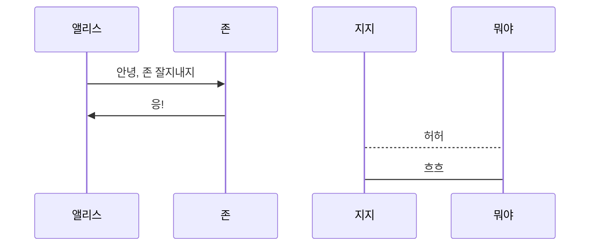

# Web

## 1. Intro

### 1.1. Static Web

접속할 때마다 변화할 필요없는 사이트

예) 학교 홈페이지, 댓글 기능이 없는 블로그

> 바크콜 하나 주세요 .
>
> 아메리카노 나왔습니다.
>
> 카페라떼 주세요.
>
> 아메리카노 나왔습니다.


### 1.2. Dynamic Web

접속할 때마다 변해야 할 필요가 있는 사이트


URI ?

URL 보다 상위의 개념, 식별자를 이용함


W3C (world wide web consortium) - 웹 표준

WHATWG (Web Hypertext Application Technology Working Group) - 웹 표준 이동


## 2. HTML ( <u>H</u>yper <u>T</u>ext <u>M</u>arkup <u>L</u>anguage )

하이퍼 텍스트: 비선형적으로 링크를 타고 넘나드는 문서

HTTP(Hyper Text Transfer Protocol): 하이퍼 텍스트를 주고 받는 규칙

Markup: 제목, 본문 등 역할을 부여하는 것

HTML 파일: HTML로 작성된 문서파일


결과적으로, 웹 페이지를 작성하기 위한 역할을 표시한 언어


### 2.1. HTML 문서의 기본 구조

`DOCTYPE`, `html 요소`, `head 요소`, `body 요소`

#### 2.1.1. DOCTYPE 선언부

사용하는 문서의 종류를 선언하는 부분

보통 html을 사용한다.

```html
<!DOCTYPE html>
```


#### 2.1.2. html 요소

HTML문서의 최상위 요소로 문서의 root를 뜻한다.

head와 body 부분으로 구분된다.

```html
<html lang="ko">
    <head>
    </head>
    <body>
    </body>
</html>
```


#### 2.1.3. head 요소

문서 제목, 문자코드(인코딩)와 같이 해당 문서 정보를 담고 있으며, 브라우저에 나타나지 않는다.

CSS 선언 혹은 외부 로딩 파일 지정 등을 작성합니다.

og와 같은 `mata tag` 선언이 이뤄집니다.

```html
<head>
    <meta charset="UTF-8">
    <title>Document</title>
</head>
```


#### 2.1.4. body 요소

브라우저 화면에 나타나는 정보로 실제 내용에 해당한다.

```html
<body>
    <header>&lt;header&gt;</header>
    <nav>&lt;nav&gt;</nav>
    <section>&lt;section&gt;</section>
    <aside>&lt;aside&gt;</aside>
    <footer>&lt;footer&gt;</footer>
</body>
```


### 2.2. Tag와 Dom 트리

#### 2.2.1. Comment

```html
<!--주석내용-->
```


#### 2.2.2. Element

HTML의 element는 tag와 contents로 구성되어 있다.

태그는 대소문자를 구별하지 않으나, 소문자로 작성해야 한다.

요소간 중첩도 가능하다.

```html
<h1>contents</h1> <!-- 닫는 Tag가 있음 -->
```


#### 2.2.3. Self-Closing element

```html
 <!-- 닫는 Tag가 없는 Tag도 존재한다. -->
```


#### 2.2.4. Attribute

```html
<a href='google.com'></a> <!-- 태그에는 속성이 지정될 수 있다. 사이는 띄어쓰지 않고 "" 사용 -->
<!-- href: 속성명, 'google.com': 속성값 -->
```

id, class, style은 태그와 상관없이 모두 사용 가능하다.

id: 유일한 식별자(중복 지정 불가능)

class: 스타일시트에 정의된 class를 요소에 지정(중복 지정 불가능)

style: 인라인 스타일을 요소에 지정


#### 2.2.5. Dom트리

body 태그와 h1태그는 부모(parent)-자식(child)관계

li 태그는 형제 관계(sibling)

h1 태그와 ul 태그는 형제 관계(sibling)

```html
<body>
    <h1>웹문서</h1>
    <ul>
        <li>HTML</li>
        <li>CSS</li>
    </ul>
</body>
```


#### 2.2.6. 시맨틱태그

컨텐츠의 의미를 설명하는 태그로서, HTML5에 새롭게 추가된 시맨틱 태그가 있다.

|    태그     |                             설명                             |
| :---------: | :----------------------------------------------------------: |
| **header**  |                헤더 (문서 전체나 섹션의 헤더)                |
|   **nav**   |                          네비게이션                          |
|  **aside**  | 사이드에 위치한 공간으로, 메인 콘텐츠와 관련성이 적은 콘텐츠에 사용 |
| **section** | 문서의 일반적인 구분으로 컨텐츠의 그룹을 표현하며, 일반적으로 h1~h6 요소를 가짐 |
| **article** | 문서, 페이지, 사이트 안에서 독립적으로 구분되는 영역(포럼/신문 등의 글 또는 기사) |
| **footer**  |                푸터 (문서 전체나 섹션의 푸터)                |


개발자 및 사용자 뿐만 아니라 검색엔진(구글, 네이버)등에 의미 있는 정보를 그룹을 태그로 표현하여 단순히 보여주기 위한 것을 넘어서 의미를 가지는 태그들을 활용하기 위한 노력

* non semantic요소: div, span, SEO(search Engine Optimization)
* SEO: 웹 페이지 검색 엔진이 자료를 수집하고 순위를 매기는 방식에 맞게 웹 페이지를 구성해서 검색 결과의 상위에 노출될 수 있도록 하는 작업

```html
<div></div>
```


### 2.3. Markup - Tag의 종류

#### 2.3.1. 텍스트 태그

```html
<p></p>
```

```html
<b></b>
```


#### 2.3.2. 레이아웃 태그

```html
<div>의미 없는 블록</div>
```

```html
<span>의미 없는 인라인</span>
```


#### 2.3.3. 링크 태그

```html
<a href="google.com"/>
```


#### 2.3.4. 이미지 태그

img 태그에 사용되는 추가 속성

1. tabindex: 사용자가 탭을 누를 때의 순서 지정
2. alt: 이미지가 로드되지 않을 때 보여지는 문구
3. width: 이미지 너비 지정
4. height: 동영상의 높이 지정
5. poster: 동영상 준비 중에 표시될 이미지 경로

```html

```


#### 2.3.5. 미디어 태그

iframe  태그에 사용되는 추가 속성

1. width: IFrame 창의 가로 길이 결정
2. height: IFrame 창의 세로 길이 결정

```html
<iframe src="https://www.w3schools.com"></iframe>
```


## 3. CSS ( <u>C</u>ascading <u>S</u>tyle <u>S</u>heet )


## 4. JavaScript


— (`alt + 0151`)




```sequence
Client-> Server:
Server-> me:
me --> you:

```

